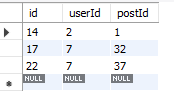

### Login 页面

### Register 页面

注册已经存在的账号会提示

### Home 页面

Login 成功后进入主页面

可以切换全局 DarkMode

在 Share 组件中可以选择添加图片,文字并分享

可以对自己或他人的 post 评论点赞分享

点赞后可以发现数据库中添加了 likes

### Profile

从主页可以点击自己或他人姓名进入 Profile 页面

进入他人 profile 可以进行关注

进入自己 profile 可以进行更新信息,包括修改头像与背景图,修改用户信息等.

### 待完成:

- 左右导航栏的逻辑,包括查看朋友,显示近期操作等

* Nav 的搜索等
